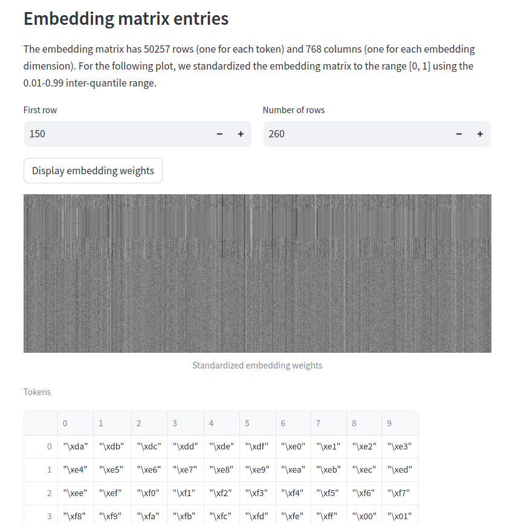
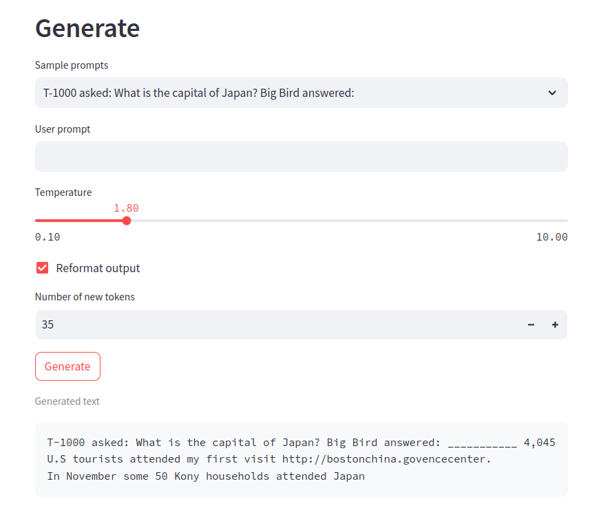
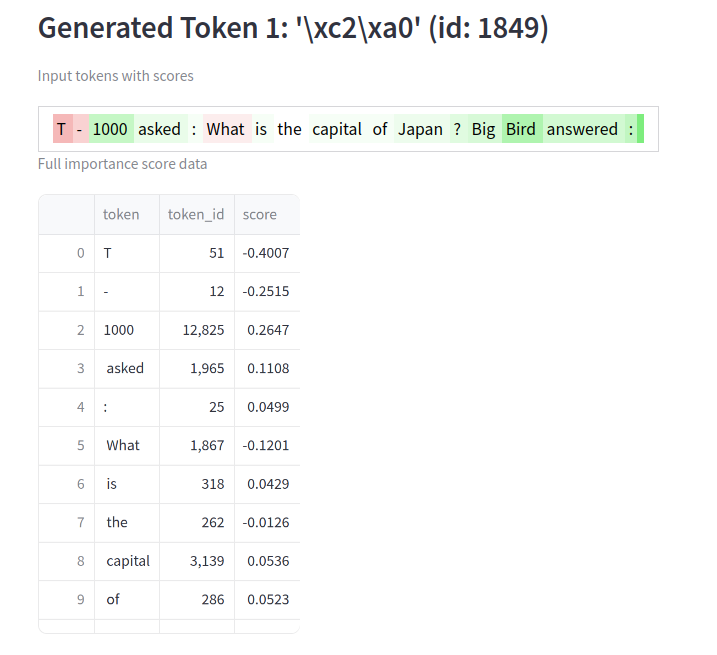
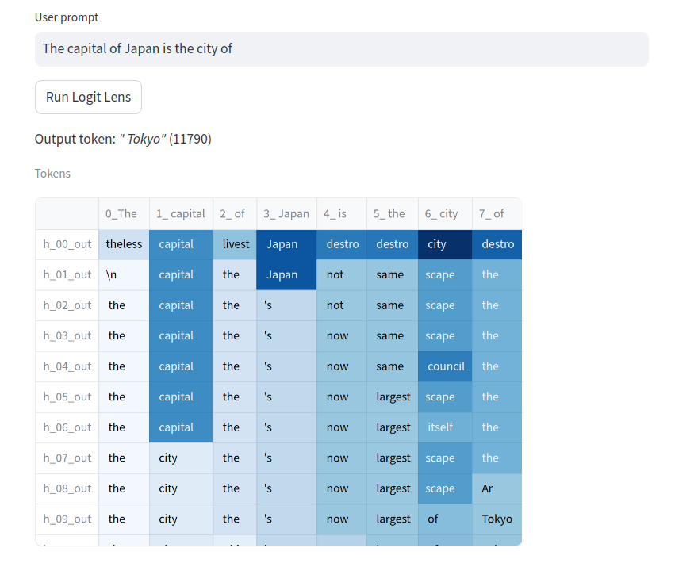
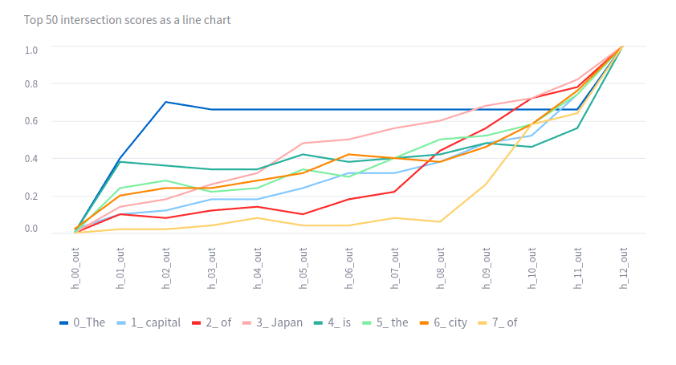
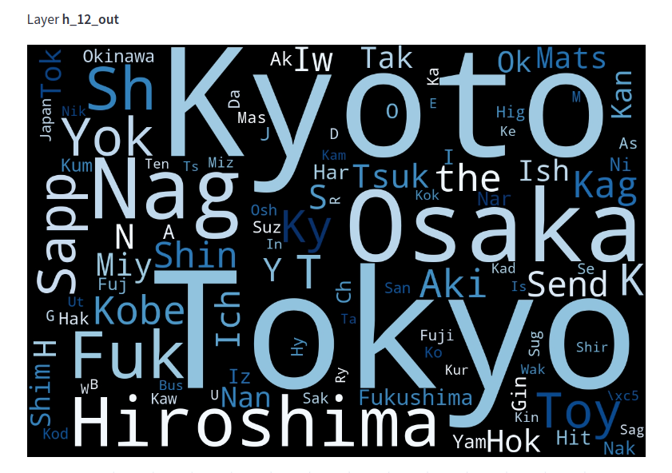

# RevLLM

Reverse Engineering Tools for Large Language Models


## Introduction

RevLLM is a Python library designed to facilitate the analysis of Transformer
Language Models, particularly focusing on generative, decoder-type
transformers. Our library aims to democratize the access to advanced
explainability methods for data scientists and machine learning engineers who
work with language models. Built on top of Andrej Karpathy's esteemed nanoGPT,
RevLLM stands as a robust and user-friendly tool in the field of natural
language processing.

## Features

- **Extensive Model and Method Documentation**. Documentation is available directly in the provided streamlit dashboard.
- **GPT-2 Models**: Automatic download and usage of GPT-2 models (thanks to Huggingface integration).
- **Model Analysis**: Deep insights into transformer language models.
- **Code base**: Simple, easy-to-understand and self-contained.

Feature rundown:

### Tokenizer Analysis


### Embedding Matrix Statistics and Visualization



### Generation with Top-k Sampling and Temperature



### Prompt Importance Analysis



### Logit Lens







## Automatic Installation

To install RevLLM, simply run the following command in your Python environment:

```bash
./make_mamba_env.sh
```

Proceed to the [next section](#running-the-demo-app) to run the demo app.

## Manual Installation

### Install the dependencies

The app uses a Python distribution called [Anaconda](https://www.anaconda.com/). Alternatively, you can use
Micromamba, which is a lightweight version of Anaconda. 

To install Anaconda, follow the instructions on at 
(https://docs.anaconda.com/free/anaconda/install/windows/).

To install Micromamba, follow the instructions at 
(https://mamba.readthedocs.io/en/latest/installation/micromamba-installation.html)

### Create the Anaconda `revllm` environment 

Open the shell and navigate to the directory where you cloned the repository. 
Then, run the following command to create the `revllm` environment:

```bash
conda create -n revllm --yes --file conda_packages.txt -c conda-forge --strict-channel-priority
```

Activate the `revllm` environment by running
```bash
conda activate revllm
```

### Create the Micromamba `revllm` environment

Alternatively, you can use Micromamba to create the `revllm` environment.

```bash
micromamba self-update --yes
micromamba create -n revllm --yes --file conda_packages.txt -c conda-forge
```

### Update the `revllm` environment

To update the `revllm` environment, delete the existing environment and create it again:

```bash
conda env remove -n revllm
```

or, if you are using Micromamba:

```bash
micromamba env remove -n revllm
```

Then, follow the instructions above to create the `revllm` environment.

## Running the Demo App

To run the app, open the shell and navigate to the directory where you cloned the repository. 
Then, run the following command to activate the `revllm` environment:

```bash
conda activate revllm
```

Or, if you are using Micromamba, run the following command to activate the `revllm` environment:

```bash
micromamba activate revllm
```

Execute the following commands to start the demo app:

```bash
./run_demo.sh
```

The app should now be running on `http://localhost:8608/`.

## License

_RevLLM_ is released under the MIT License.

## Acknowledgements

Special thanks to Andrej Karpathy and contributors to the [nanoGPT](https://github.com/karpathy/nanoGPT)project 
for their foundational work in the field.
