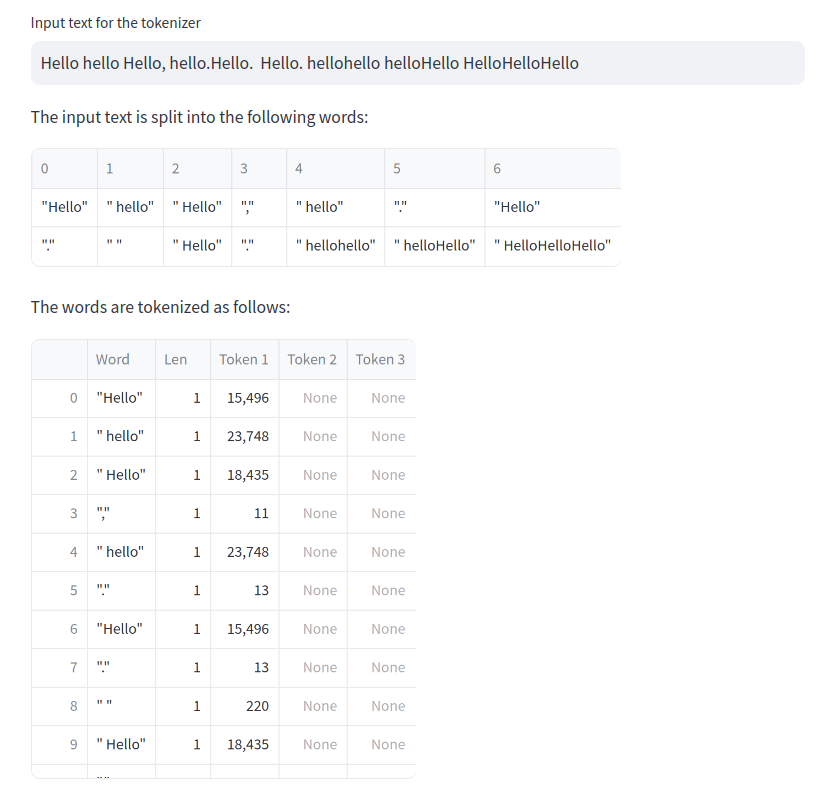

RevLLM is a Python library and a Streamlit webapp for exploring internal workings of Large Language Models (LLMs).

RevLLM builds on top the _nanoGPT_ implementation of the GPT-2 model family developed by Andrej Karpathy
and adheres to its spirit of simplicity and transparency. We restrict the dependencies to a 
bare minimum and strive for clean and simple code that can be easily understood and reused.  

The RevLLM library implements various methods for analyzing the internal data-flow
of transformer decoder-type models. In particular, RevLLM,

* shows how transformer models map a prompt sentence to a sequence of tokens (integers). 
* explores the token embedding space with statistical methods.
* implements various input prompt importance methods to identify prompt tokens that the model pays most attention to.
* implements logit lens interpretability methods to shed light on the flow of information thought the transformer block sequence.

To facilitate the ease of use and provide a hassle-free experimentation experience, we accompany 
the library with an interactive Streamlit app and provide a web interface to access the library functionality.
The app automatically downloads and instantiates a chosen model from the GPT-2 family using the _Huggingface_ model 
repository, and exposes the RevLLM library methods through a convenient interface.

### Logit Lens

### Prompt Importance Analysis

# Self-Attention Analysis

### Tokenizer Analysis

GPT-2 maintains a fixed dictionary of around 50k tokens. The model uses the 
[Byte Pair Encoding](https://en.wikipedia.org/wiki/Byte_pair_encoding) 
tokenizer algorithm split any given input sentence into a token sequence. This token sequence is mapped to a 
sequence of integers that is consumed by the model.

### Embedding Matrix Statistics and Visualization

### Generation with Top-k Sampling and Temperature

---

The development of RevLLM was made possible by the funding of the Prototype Fund. 

--- 

* [Impressum / Imprint](imprint.html)
* [Datenschutzerklärung / Privacy Policy](privacy.html)
